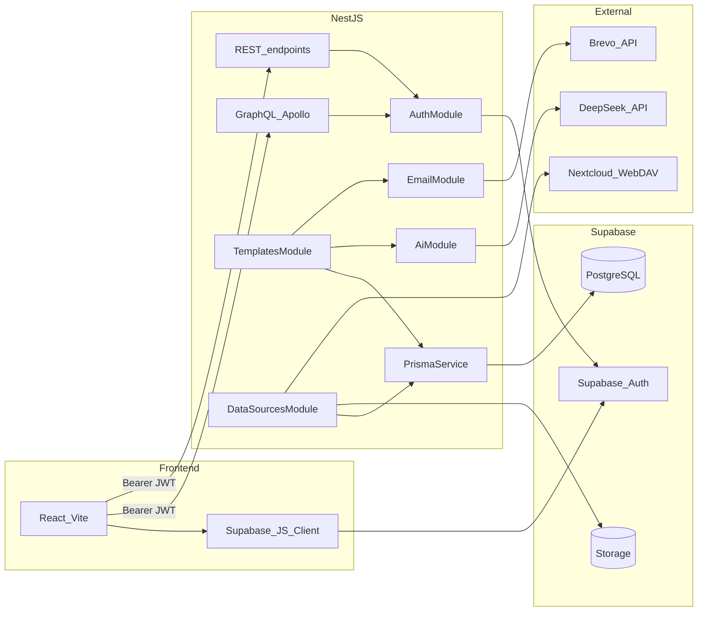

# Backend architecture

## System context

ExpenseAI backend is a NestJS modular monolith between the React frontend and Supabase (Auth + Postgres + Storage).

Implemented integrations:

- DeepSeek (`AiService`) for template generation and expense analysis.
- Brevo HTTP API (`EmailService`) for sending rendered test emails.
- Supabase Storage + Nextcloud WebDAV as pluggable expense data sources.

Planned (not wired yet):

- Monthly cron webhook pipeline (`/api/cron/process-summaries`).

## Module graph

`AppModule` imports:

- `ConfigModule` (global)
- `GraphQLModule` (Code First, `src/schema.gql`)
- `PrismaModule`
- `AuthModule`
- `AiModule`
- `TemplatesModule`
- `DataSourcesModule`
- `EmailModule`

### Implemented modules

| Module | Responsibility |
|---|---|
| `AuthModule` | JWT strategy + guards for REST/GraphQL |
| `PrismaModule` | Shared Prisma adapter client |
| `AiModule` | DeepSeek template generation and expense analysis |
| `TemplatesModule` | Template CRUD + active template + source settings + test-email mutation |
| `DataSourcesModule` | Source providers, upload endpoint, source resolution |
| `EmailModule` | Brevo email sending |

### Planned modules

| Module | Responsibility |
|---|---|
| `CronModule` | Batch processing endpoint for monthly summaries |
| `UsersModule` | Dedicated profile logic beyond on-demand upsert |

## Authentication flow

1. Frontend authenticates with Supabase and gets `access_token`.
2. Frontend calls NestJS with `Authorization: Bearer <token>`.
3. REST uses `JwtAuthGuard`; GraphQL uses `GqlAuthGuard`.
4. `JwtStrategy` validates token via:
   - Supabase JWKS (`SUPABASE_URL`) for ES256 projects
   - or legacy `SUPABASE_JWT_SECRET` for HS256
5. Handlers get user via `@CurrentUser()` / `@CurrentUserGql()`.

## Data-source architecture

Expense data source is resolved per user from:

- `data_source_type` (`FILE_UPLOAD` / `NEXTCLOUD`)
- `data_source_config` (provider-specific JSON)

`DataSourceResolverService` dispatches to:

- `FileUploadProvider` (read file from Supabase Storage)
- `NextcloudProvider` (read file from Nextcloud WebDAV path)

## API surface

### REST

| Method | Path | Auth | Notes |
|---|---|---|---|
| `GET` | `/` | Public | Health/hello |
| `GET` | `/profile` | JWT | Auth smoke test |
| `POST` | `/api/data-sources/upload` | JWT | Upload `.txt/.csv` (max 2MB), set source to `FILE_UPLOAD` |
| `GET` | `/api/data-sources/upload/current` | JWT | Return current uploaded file metadata + content for preview/edit UI |
| `PUT` | `/api/data-sources/upload/current` | JWT | Overwrite currently configured uploaded file (`multipart`, field `file`) |

### GraphQL

Endpoint: `/graphql`

| Kind | Name | Auth | Notes |
|---|---|---|---|
| Query | `myTemplates` | JWT | List current user templates |
| Query | `myTemplateSettings` | JWT | Active template + source settings |
| Mutation | `generateTemplate` | JWT | Generate template via DeepSeek |
| Mutation | `createTemplate` | JWT | Create template |
| Mutation | `updateTemplate` | JWT | Update template |
| Mutation | `deleteTemplate` | JWT | Delete template |
| Mutation | `setActiveTemplate` | JWT | Set active template |
| Mutation | `updateDataSource` | JWT | Switch/update source config |
| Mutation | `sendTestEmail` | JWT | Render active template with sample values and send via Brevo |

## Rendering + email flow

`TemplatesService.sendTestEmail`:

1. Ensures user exists and has active template.
2. Uses `template-renderer.ts` to inject sample values.
3. Calls `EmailService.sendEmail(...)` to Brevo `/smtp/email`.

## Error handling and resiliency

- Service layer throws typed Nest exceptions for domain errors.
- Provider misconfiguration returns `ServiceUnavailableException`.
- Upload/download storage failures bubble with context-rich messages.
- Cron fault-tolerance behavior is planned for batch processing.

## Security notes

- Secrets remain server-side (`DEEPSEEK_API_KEY`, `BREVO_API_KEY`, `SUPABASE_SERVICE_ROLE_KEY`, Nextcloud credentials).
- Frontend only uses Supabase user access token; service role key is never exposed.
- Prisma adapter strips SSL params from URL and applies explicit TLS option via `DATABASE_SSL_REJECT_UNAUTHORIZED`.

See also [database.md](./database.md) and [conventions.md](./conventions.md).
