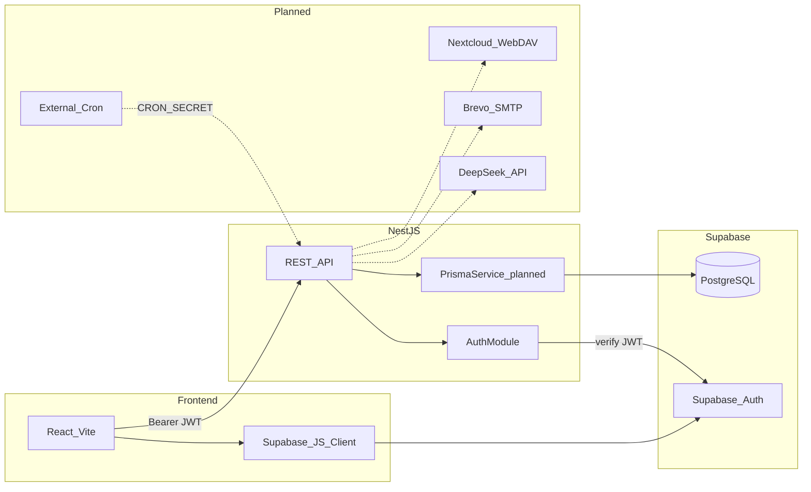
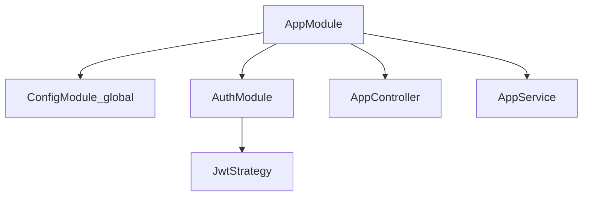
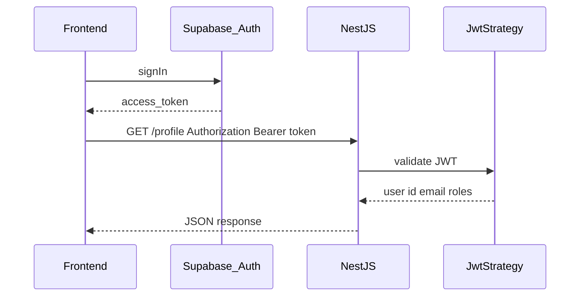
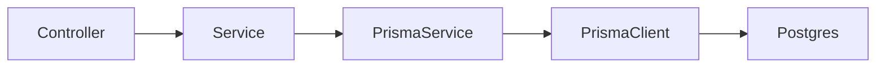

# Backend architecture

## System context

ExpenseAI is a two-repo full-stack app. This backend sits between the React frontend and Supabase-managed infrastructure (Auth + PostgreSQL), with planned integrations for DeepSeek, Brevo SMTP, and Nextcloud WebDAV.

## Current module graph

**Implemented today:**

| Module / piece | Responsibility |
|----------------|----------------|
| `ConfigModule` | Global env via `ConfigService` |
| `AuthModule` | Registers `JwtStrategy`; exports strategy for guards |
| `AppController` | `GET /`, `GET /profile` (JWT-protected) |
| `AppService` | Placeholder hello service |

**Planned modules** (from [PLAN.md](../PLAN.md)):

| Module | Responsibility |
|--------|----------------|
| `PrismaModule` | Singleton `PrismaService`, DB connection lifecycle |
| `UsersModule` | User profile CRUD, sync with Supabase Auth UID |
| `TemplatesModule` | HTML template CRUD, active template selection |
| `AiModule` | DeepSeek calls for onboarding templates and expense categorization |
| `EmailModule` | Brevo SMTP, test sends, rendered summaries |
| `WebdavModule` | Nextcloud file fetch per user path |
| `CronModule` | `POST /api/cron/process-summaries` with `CRON_SECRET` |

## Authentication flow

1. User signs in on the **frontend** via Supabase Auth (`signInWithPassword` / `signUp`).
2. Supabase issues an **access token** (JWT). The frontend stores the session and sends `Authorization: Bearer <token>` to NestJS.
3. Request hits a route with `@UseGuards(JwtAuthGuard)`.
4. `JwtStrategy` extracts the bearer token and verifies it with `SUPABASE_JWT_SECRET`.
5. `validate()` maps the payload to `{ id: sub, email, roles: role }`.
6. `@CurrentUser()` injects that object into the handler.

**Not implemented yet:** automatic creation of `User` rows in Postgres on first login, role-based guards (single role: User per plan).

## Database access pattern (target)

- Schema: [prisma/schema.prisma](../prisma/schema.prisma)
- Migrations: `pnpm prisma migrate dev`
- Config: [prisma.config.ts](../prisma.config.ts) uses `DIRECT_URL` or `DATABASE_URL`

Until `PrismaModule` exists, no application code should query the database.

## HTTP API (current)

| Method | Path | Auth | Notes |
|--------|------|------|-------|
| `GET` | `/` | Public | Health/hello |
| `GET` | `/profile` | JWT | Auth smoke test |

**Planned:** global prefix `/api`, cron webhook, template and user endpoints. GraphQL (Code First) is in the product plan but REST is what ships first.

## Error handling (conventions)

- Throw NestJS HTTP exceptions from services (`NotFoundException`, `BadRequestException`, `UnauthorizedException`).
- Prefer consistent error shapes per module once a global exception filter is introduced.
- Cron and batch jobs should log per-user failures and continue processing other users ([PLAN.md](../PLAN.md) fault tolerance).

## Security notes

- Cron endpoint must verify `Authorization: Bearer <CRON_SECRET>` (planned).
- Server-side API keys (DeepSeek, SMTP, Nextcloud) stay in env — never exposed to the frontend.
- Supabase JWT secret must match the project's JWT signing configuration.

See also [conventions.md](./conventions.md) and [database.md](./database.md).
