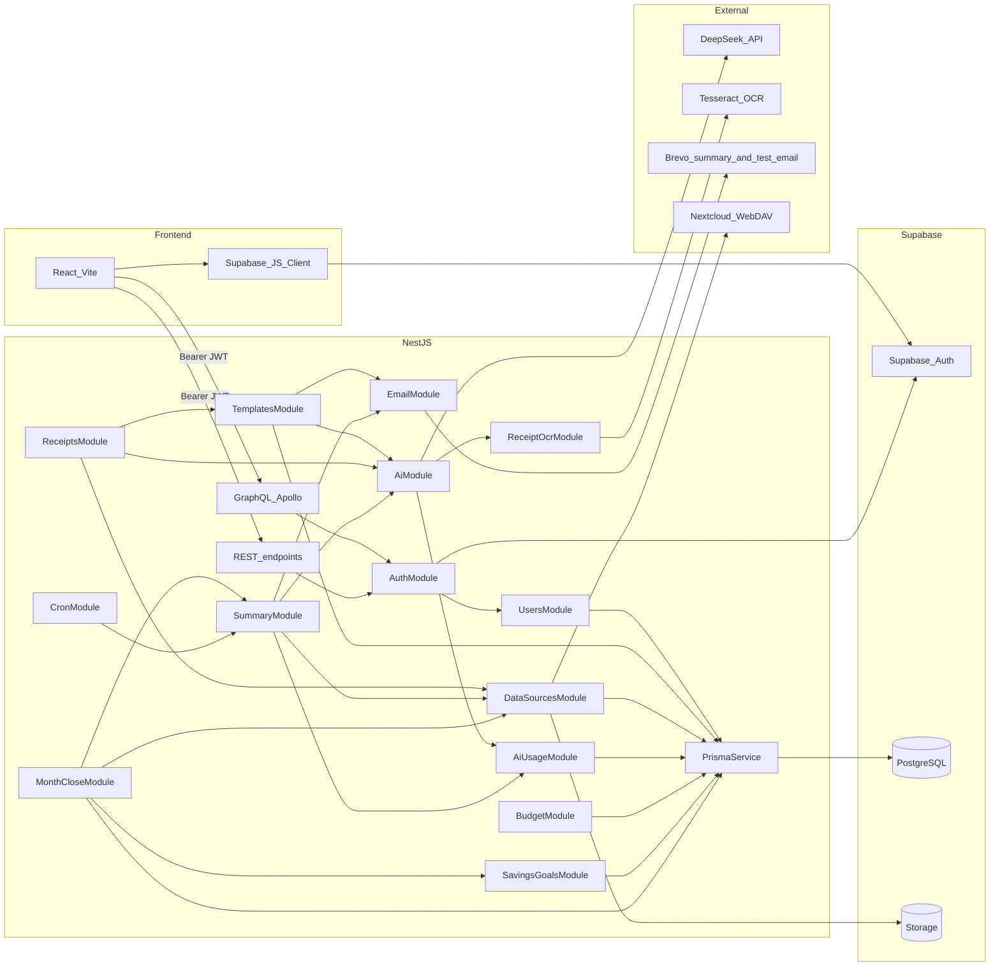

# Backend architecture

## System context

ExpenseAI backend is a NestJS modular monolith between the React frontend and Supabase (Auth + Postgres + Storage).

Implemented integrations:

- DeepSeek (`AiService`) for template generation, expense analysis, receipt text extraction, and Suggest categories.
- Tesseract.js + Sharp (`ReceiptOcrService`) for receipt image preprocessing and OCR (`eng.traineddata` / `pol.traineddata` at repo root).
- Brevo HTTP API (`EmailService`) for scheduled / send-now monthly summary emails and rendered test emails.
- Supabase Storage + Nextcloud WebDAV as pluggable expense data sources (`FILE_UPLOAD` / `NEXTCLOUD` only — no Drive/Dropbox).

## Module graph

`AppModule` imports:

- `ConfigModule` (global)
- `GraphQLModule` (Code First, `src/schema.gql`)
- `PrismaModule`
- `AuthModule`
- `UsersModule`
- `AiUsageModule`
- `AiModule`
- `TemplatesModule`
- `DataSourcesModule`
- `EmailModule`
- `ReceiptsModule`
- `SummaryModule`
- `BudgetModule`
- `SavingsGoalsModule`
- `MonthCloseModule`
- `CronModule`

`src/common` holds shared helpers (not a feature module imported by `AppModule`).

### Implemented modules

| Module               | Responsibility                                                                         |
| -------------------- | -------------------------------------------------------------------------------------- |
| `AuthModule`         | JWT strategy + guards for REST/GraphQL                                                 |
| `UsersModule`        | User-profile provisioning and authenticated account deletion                           |
| `PrismaModule`       | Shared Prisma adapter client                                                           |
| `AiUsageModule`      | Monthly AI credit limits, usage audit log, GraphQL usage queries                       |
| `AiModule`           | DeepSeek template generation, expense analysis, Suggest categories, receipt extraction |
| `ReceiptOcrModule`   | Tesseract worker lifecycle, image preprocessing (Sharp), OCR text extraction           |
| `TemplatesModule`    | Template CRUD + active template + source settings + test-email mutation                |
| `DataSourcesModule`  | Source providers, upload endpoint, source resolution                                   |
| `EmailModule`        | Brevo email sending (summary delivery + test email)                                    |
| `ReceiptsModule`     | Receipt scan + `approveReceiptExpenses` GraphQL mutations + OCR                        |
| `SummaryModule`      | Summary schedule + monthly analytics GraphQL + batch summary pipeline                  |
| `BudgetModule`       | Reusable monthly category budget (+ optional extra-expense) GraphQL                    |
| `SavingsGoalsModule` | Long-term savings events, sub-goals, and contribution-log GraphQL                      |
| `MonthCloseModule`   | Month-close status, leftover allocation mutation, and new-month write guard            |
| `CronModule`         | Secured REST webhook for hourly batch processing                                       |

### REST endpoints

| Method | Path                          | Auth                 | Notes                                           |
| ------ | ----------------------------- | -------------------- | ----------------------------------------------- |
| `POST` | `/api/cron/process-summaries` | `Bearer CRON_SECRET` | Hourly batch trigger for monthly summary emails |

## Authentication flow

1. Frontend authenticates with Supabase (email/password or Google OAuth 2.0) and gets `access_token`.
2. Frontend calls NestJS with `Authorization: Bearer <token>`.
3. REST uses `JwtAuthGuard`; GraphQL uses `GqlAuthGuard`. (REST controllers were removed except cron; guards remain available if REST is reintroduced.)
4. `JwtStrategy` validates token via:
   - Supabase JWKS (`SUPABASE_URL`) for ES256 projects
   - or legacy `SUPABASE_JWT_SECRET` for HS256
5. Handlers get user via `@CurrentUser()` / `@CurrentUserGql()`.
6. `UserProfileService.ensureUserProfile` upserts local `User` profile on first authenticated access (UsersModule).

## Data-source architecture

Expense data source is resolved per user from:

- `data_source_type` (`FILE_UPLOAD` / `NEXTCLOUD`)
- `data_source_config` (provider-specific JSON)

`DataSourceResolverService` dispatches to:

- `FileUploadProvider` (read file from Supabase Storage)
- `NextcloudProvider` (read file from Nextcloud WebDAV path)

`SupabaseStorageService` talks to Supabase Storage via direct REST (`axios` + service role key), not the Supabase JS client. It supports `readTextFileOrEmpty` for optional file reads used by receipt approval.

## API surface

All client-facing operations are exposed through GraphQL at `/graphql`.

| Kind     | Name                            | Auth   | Notes                                                                                                |
| -------- | ------------------------------- | ------ | ---------------------------------------------------------------------------------------------------- |
| Query    | `health`                        | Public | Health/hello smoke check                                                                             |
| Query    | `myProfile`                     | JWT    | Auth smoke test                                                                                      |
| Query    | `myTemplates`                   | JWT    | List current user templates                                                                          |
| Query    | `myTemplateSettings`            | JWT    | Active template + source settings                                                                    |
| Query    | `currentExpenseFile`            | JWT    | Current uploaded file metadata + content                                                             |
| Query    | `currentMonthExpenses`          | JWT    | Structured category + unassigned breakdown of the uploaded expense file                              |
| Mutation | `generateTemplate`              | JWT    | Generate template via DeepSeek                                                                       |
| Mutation | `createTemplate`                | JWT    | Create template                                                                                      |
| Mutation | `updateTemplate`                | JWT    | Update template                                                                                      |
| Mutation | `deleteTemplate`                | JWT    | Delete template                                                                                      |
| Mutation | `setActiveTemplate`             | JWT    | Set active template                                                                                  |
| Mutation | `updateDataSource`              | JWT    | Switch/update source config                                                                          |
| Mutation | `uploadExpenseFile`             | JWT    | Upload `.txt/.csv` (max 5MB, base64), set source to `FILE_UPLOAD`                                    |
| Mutation | `overwriteCurrentExpenseFile`   | JWT    | Overwrite currently configured uploaded file (base64)                                                |
| Mutation | `saveCurrentMonthExpenses`      | JWT    | Serialize categorized + unassigned items and overwrite the uploaded expense file                     |
| Mutation | `suggestExpenseCategories`      | JWT    | AI-suggest categories for unassigned expense lines (uses AI credits; does not auto-save)             |
| Mutation | `sendTestEmail`                 | JWT    | Render active template with sample values and send via Brevo                                         |
| Query    | `mySummarySchedule`             | JWT    | Read automatic summary schedule settings                                                             |
| Mutation | `updateSummarySchedule`         | JWT    | Update schedule and recalculate `next_summary_at`                                                    |
| Mutation | `updateSalary`                  | JWT    | Persist current profile salary (`User.salary_cents`) from a money string                             |
| Mutation | `sendSummaryNow`                | JWT    | Analyze the current expense file and email a real summary without changing schedule                  |
| Query    | `mySummaries`                   | JWT    | List persisted monthly analytics for ended months (`period < current YYYY-MM`)                       |
| Query    | `mySummary(month)`              | JWT    | Single-month analytics (`null` if current/future or missing); months before `2026-01` rejected       |
| Query    | `summaryCategoryKeys`           | JWT    | Closed English category vocabulary for manual backfill UI                                            |
| Mutation | `createManualSummary`           | JWT    | Create historical analytics (`source = MANUAL`) for any ended month (`period < current YYYY-MM`)     |
| Mutation | `updateManualSummary`           | JWT    | Update an existing analytics row for an ended month (scheduled or manual)                            |
| Query    | `myMonthlyBudget`               | JWT    | Current reusable monthly category budget (`null` if never saved); may include optional extra expense |
| Mutation | `saveMonthlyBudget`             | JWT    | Upsert the user's monthly category budget template (and optional extra expense) until overwritten    |
| Query    | `mySavingsGoals`                | JWT    | Long-term savings events with sub-goals, contributions, and derived progress                         |
| Mutation | `createSavingsGoalEvent`        | JWT    | Create a named long-term savings event                                                               |
| Mutation | `updateSavingsGoalEvent`        | JWT    | Update an owned event name, currency, or target date                                                 |
| Mutation | `deleteSavingsGoalEvent`        | JWT    | Delete an owned event (cascades items and contributions)                                             |
| Mutation | `createSavingsGoalItem`         | JWT    | Add a sub-goal to an owned event; returns the parent event                                           |
| Mutation | `updateSavingsGoalItem`         | JWT    | Update an owned sub-goal; returns the parent event                                                   |
| Mutation | `deleteSavingsGoalItem`         | JWT    | Delete an owned sub-goal; returns the parent event                                                   |
| Mutation | `addSavingsGoalContribution`    | JWT    | Append a dated deposit to an owned sub-goal; returns the parent event                                |
| Mutation | `deleteSavingsGoalContribution` | JWT    | Delete an owned contribution; returns the parent event                                               |
| Query    | `monthClosureStatus`            | JWT    | Whether previous period needs closure, leftover cents, and related status fields                     |
| Mutation | `closeMonth`                    | JWT    | Allocate 100% of leftover to sub-goals; side effects in one transaction (see month-close flow)       |
| Mutation | `deleteMyAccount`               | JWT    | Delete Supabase Auth identity, profile data, and uploaded expense file                               |
| Mutation | `scanReceipt`                   | JWT    | Upload receipt image (JPEG/PNG/WEBP, max 5MB, base64); returns `{ extractedText }`                   |
| Mutation | `approveReceiptExpenses`        | JWT    | Append edited receipt expense text to the user's uploaded expense file                               |
| Query    | `myAiUsageSummary`              | JWT    | Current-month AI credit limit / used / remaining                                                     |
| Query    | `myAiUsageLog`                  | JWT    | Paginated AI spend audit (`limit`, `offset`)                                                         |

File upload mutations accept `ExpenseFileUploadInput` / `ScanReceiptInput` with `fileName`, `mimeType`, and `contentBase64` fields.

## Month-close flow

Product rules: [month-close.md](../../expenses-tracking-docs/features/month-close.md).

When a new calendar month starts in `User.summary_timezone` and leftover cash from the previous period is **positive** (`salary_cents − total expense-file amount`), the user must close that month before writing new expenses.

`monthClosureStatus` exposes `needsClosure` and leftover. `needsClosure` is true only when leftover **> 0** and no `MonthClose` row exists for the previous period. Zero or negative leftover does not block the new month.

`closeMonth` runs in one transaction:

1. Validate allocations sum exactly to leftover (positive integer cents; sub-goals owned by the user and same currency as `User.summary_currency`).
2. Create `SavingsGoalContribution` rows (`note = Domknięcie {period}`).
3. Insert `SummaryAnalytics` for the previous period if missing (`source = MANUAL`, unassigned lines fold into Other, **no AI**).
4. Clear the expense file via DataSources.
5. Insert `MonthClose`.

While `needsClosure` is true, these writes are blocked: `saveCurrentMonthExpenses`, upload/overwrite expense file, `approveReceiptExpenses`. Reads and ended-month analytics stay available; salary can still be edited. Month close does not send email and does not use AI credits.

Dev/test: backend `TEST_NOW_ISO` (ignored in production) and frontend `X-Test-Now` / `?testNow=ISO` (Vite dev) simulate a month boundary.

## Receipt scan + approval flow

`scanReceipt` (`ReceiptsResolver` → `ReceiptsService`):

1. Ensures the authenticated user profile exists.
2. Validates image type and size.
3. `AiService.extractExpensesFromImage` checks the AI credit limit, preprocesses the image (Sharp), runs OCR (`ReceiptOcrService` / Tesseract), then sends OCR text to DeepSeek and records token usage.
4. Returns plain-text expense lines (or `NO_EXPENSES_FOUND`).

DeepSeek's hosted API is text-only (no image input support), so extraction accuracy depends entirely on OCR text quality:

- `ReceiptOcrService` runs Tesseract with `PSM.SINGLE_COLUMN` (configurable via `RECEIPT_OCR_PSM`), not `PSM.AUTO`. Receipts are narrow single-column strips of text; `PSM.AUTO`'s full page-layout analysis reliably misdetects the item-name column and the "qty × unit price / total" column as two separate blocks and emits all names first, then all prices — silently decoupling every item from its price. `SINGLE_COLUMN` keeps each physical receipt line intact.
- `receipt-image-preprocessor.ts` builds 3 OCR-ready variants (contrast-enhanced, adaptive-threshold, fixed-threshold) in parallel; `pickBestCandidate` scores them by `confidence × wordCount` rather than raw word count (which rewards noisy binarization that "recognizes" garbage tokens).
- `RECEIPT_SCAN_PROMPT` encodes the structural conventions of Polish receipts (name + trailing VAT-letter line, `qty x unit_price total` line below it, `OPUST` discount lines tied to the preceding item) and explicitly forbids borrowing a price from an unrelated section (e.g. VAT/totals block) when an item's own price is unclear — the model must skip that item instead.

`approveReceiptExpenses` (`ReceiptsResolver` → `ReceiptsService`):

1. Resolves the user's `FILE_UPLOAD` source config via `TemplatesService`.
2. Reads current file content (empty string if missing).
3. Appends approved receipt text and overwrites the Storage object.
4. Updates `uploadedAt` in `data_source_config`.

## Expense analysis flow

`AiService.analyzeExpenses(userId, rawExpenseContent, salaryCents, language, currency, period, trigger)` returns `{ summary, snapshot }`:

1. `AiUsageService.ensureWithinLimit(userId)` rejects the call when the monthly credit budget is exhausted.
2. `parseExpenseFile()` (`src/ai/expense-file.parser.ts`) deterministically parses raw expense text into a canonical expense list (every amount is stored in cents). Optional `CategoryKey |` prefixes are **preserved** on each row (`categoryKey`) rather than stripped; duplicate names are only merged when they share the same category (or are both unassigned). Salary is **not** read from the file — callers pass `User.salary_cents`. Structured UI read/write uses `parseCategorizedExpenseFile` / `serializeCategorizedExpenseFile` so prefixes round-trip for in-month editing.
3. `analyzeExpenses()` splits the canonical list into `preCategorized` (has a `categoryKey`) and `toCategorize` (does not). Only `toCategorize` — plus a totals-only hint about the pre-categorized category sums — is sent to DeepSeek; lines the user already assigned a category to are never re-categorized by AI. DeepSeek's JSON response is limited to closed English category names + `itemIds` assignments (for `toCategorize` items only, may be an empty array when nothing is left) and a `savingsMessage` — it never computes or returns amounts, totals, salary, or the current month. Allowed category keys live in `src/summary/summary-category.constants.ts`.
4. Token usage from `response.usage` is written to `AiUsageLog` (success or failure) with action `EXPENSE_SUMMARY` and the caller-supplied trigger (`MANUAL` / `SCHEDULED`). Skipping already-categorized lines shrinks the prompt/response and therefore the AI credits charged for months with heavy in-app categorization.
5. `splitExpensesByAssignment()` (`src/ai/expense-category-assignment.ts`) is the single place that merges deterministic `categoryKey` expenses with the AI's `itemIds` assignment; both `reconcileExpenseAnalysis()` and `buildCanonicalCategoriesFromExpenses()` build on it so the email and the stored analytics snapshot always agree. `reconcileExpenseAnalysis()` (`src/ai/expense-analysis.reconciler.ts`) rebuilds `salaryAmount`, `totalExpenses`, `savingsAmount`, and per-category/item totals purely from the canonical cents plus the provided salary. AI-provided `itemIds` are validated against the canonical list; unknown or duplicate IDs are dropped and any unassigned expenses fall into an "Other expenses" category. This guarantees totals stay internally consistent even if the AI miscategorizes something.
6. `formatMoneyAmount()` (`src/ai/expense-amount.formatter.ts`) formats cents into locale-aware strings (e.g. `1 234,56 zł` for PL, `1,234.56 PLN` for EN) for the email `summary`.
7. `currentMonth` is derived from the caller-supplied `period` (`YYYY-MM`) via `formatSummaryMonth()` instead of "now", so cron-generated summaries always label the month they actually cover.
8. `snapshot` is a cents-based `SummaryAnalyticsSnapshot` with categories remapped to the closed vocabulary via `buildCanonicalCategoriesFromExpenses()` — used to persist dashboard analytics after a successful scheduled send.

All arithmetic stays deterministic in application code; the LLM is only responsible for categorization and the natural-language `savingsMessage`.

## Summary analytics flow

Persisted monthly snapshots live in `SummaryAnalytics` (one row per `(user_id, period)`), separate from email idempotency in `SummaryLog`.

**Scheduled write** (cron only): after a successful summary email, `SummaryService.insertAnalyticsIfMissing` inserts `source = SCHEDULED` when no row exists for that period. Existing analytics are never overwritten by cron. `sendSummaryNow` emails only and does not write analytics.

**Manual backfill** (`createManualSummary` / `updateManualSummary`):

1. Validates `period` as `YYYY-MM`, rejects months before `2026-01`.
2. Create and update/view require an ended month (`period < current YYYY-MM` in the user's timezone). Once the new month has started, the previous month can be created manually. Cron never overwrites an existing analytics row for that period.
3. `parseManualSummaryPayload()` parses salary/category money strings into cents, normalizes category names through the closed vocabulary (+ aliases), and recomputes totals/savings in code.
4. Create sets `source = MANUAL` and snapshots `User.summary_currency`. Update rewrites amounts/categories/message but does not change `source` or currency.

**Reads**: `mySummaries` lists ended months only; `mySummary(month)` returns `null` for the current/future month (or missing rows); `summaryCategoryKeys` exposes the vocabulary for the UI.

### Investments as a savings bucket

Product decision: [ADR 0002](../../expenses-tracking-docs/decisions/0002-investments-as-savings-bucket.md); chart semantics: [monthly-summaries.md](../../expenses-tracking-docs/features/monthly-summaries.md).

Outflow in the canonical `Investments` category is savings-like (`SAVINGS_LIKE_CATEGORY_KEYS`), not consumption. Analytics and summary email expose a **three-bucket** split derived from stored categories (no Prisma column / no backfill):

- **Consumption spending** — `totalExpensesCents - investedCents`
- **Invested** — `Investments` category total (`investedCents`)
- **Free savings** — leftover cash (`salaryCents - totalExpensesCents`, existing `savingsCents`)

`totalExpensesCents` remains total outflow so history and user email templates stay valid.

## Budget planning (extra expense)

`BudgetModule` stores one reusable monthly category plan per user (`myMonthlyBudget` / `saveMonthlyBudget`). A new calendar month does not reset it.

Optionally, the plan may include **one named extra expense** funded by integer cut percentages on categories with non-zero planned amounts. Charts use post-cut category amounts and an extra-expense slice for money set aside. Saving with `extraExpense: null` clears any stored extra expense. No AI credits.

Product rules: [budget-planning.md](../../expenses-tracking-docs/features/budget-planning.md).

## AI credits and usage audit

Monthly AI spend is tracked in `AiUsageModule` / `AiUsageService`. Product: [ai-credits.md](../../expenses-tracking-docs/features/ai-credits.md).

- **Unit**: `1 credit = AI_TOKENS_PER_CREDIT` tokens (default `1000`), rounded up via `Math.ceil`.
- **Limit**: stored per user on `User.ai_credit_limit` (default from `AI_MONTHLY_CREDIT_LIMIT`, default `50`). Applied when the profile is first created.
- **Period**: UTC calendar month (`periodStart` inclusive → `periodEnd` exclusive).
- **Actions audited**: `TEMPLATE_GENERATION`, `EXPENSE_SUMMARY`, `RECEIPT_SCAN`, and Suggest categories (`suggestExpenseCategories`).
- **Triggers**: `MANUAL` (user-initiated GraphQL) or `SCHEDULED` (cron summary batch).
- **Enforcement**:
  - Manual AI calls (`generateTemplate`, `scanReceipt`, `sendSummaryNow`, `suggestExpenseCategories`) throw `BadRequestException` when `used >= limit`.
  - Cron batch pre-checks `hasRemainingCredits`; over-limit users are `skipped` with reason `AI credit limit reached` (no DeepSeek call).
- **Recording**: every DeepSeek completion records `prompt_tokens`, `completion_tokens`, `total_tokens`, computed `credits_used`, success flag, and optional `error_message` — even when downstream content validation fails (tokens were still spent).
- **API**: `myAiUsageSummary`, `myAiUsageLog(limit, offset)`.

## Rendering + email flow

`TemplatesService.sendTestEmail`:

1. Ensures user exists and has active template.
2. Uses `template-renderer.ts` to inject sample values.
3. Calls `EmailService.sendEmail(...)` to Brevo `/smtp/email`.

Scheduled summaries and `sendSummaryNow` also render the active template and send via the same `EmailService` / Brevo path (see [cron-summaries.md](./cron-summaries.md)).

## Error handling and resiliency

- Service layer throws typed Nest exceptions for domain errors.
- Provider misconfiguration returns `ServiceUnavailableException`.
- Upload/download storage failures bubble with context-rich messages.
- Cron fault-tolerance behavior is implemented in `SummaryService.processDueSummaries()` — per-user try/catch with `SummaryLog` persistence.
- Month-close write guard returns domain errors when `needsClosure` blocks expense-file mutations.

See [cron-summaries.md](./cron-summaries.md) for scheduler and webhook details.

## Security notes

- Secrets remain server-side (`DEEPSEEK_API_KEY`, `BREVO_API_KEY`, `SUPABASE_SERVICE_ROLE_KEY`, Nextcloud credentials, `CRON_SECRET`).
- Non-secret AI quota knobs (`AI_TOKENS_PER_CREDIT`, `AI_MONTHLY_CREDIT_LIMIT`) are env vars / GitHub environment variables.
- Frontend only uses Supabase user access token; service role key is never exposed.
- Prisma adapter strips SSL params from URL and applies explicit TLS option via `DATABASE_SSL_REJECT_UNAUTHORIZED`.

See also [database.md](./database.md), [conventions.md](./conventions.md), and [processes/ai-credit-renewal.md](./processes/ai-credit-renewal.md).
