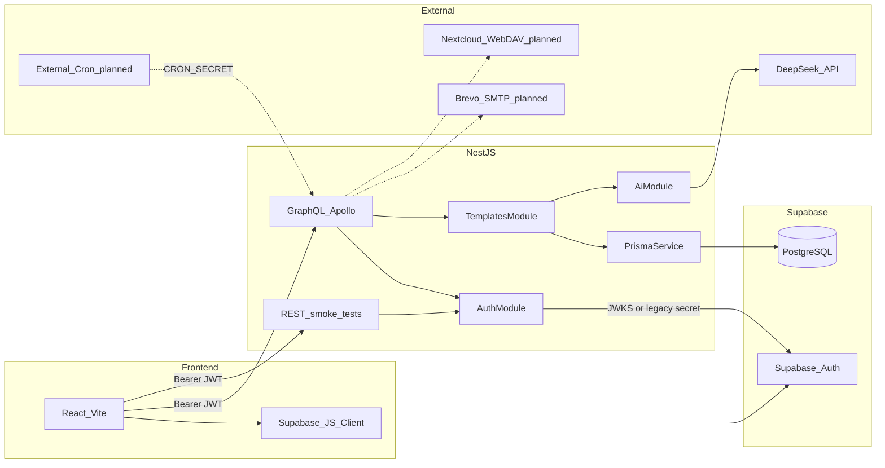
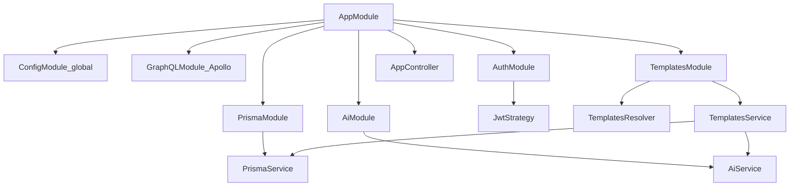
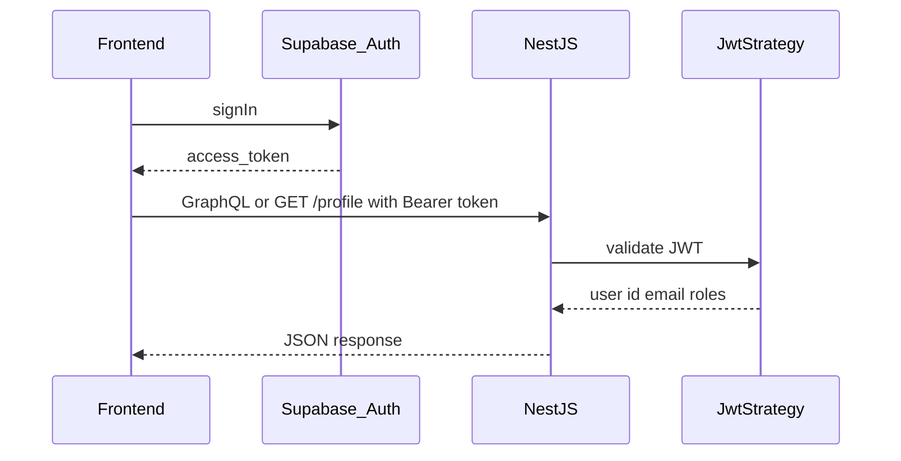
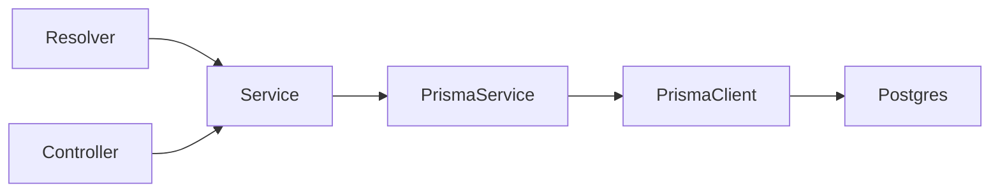

# Backend architecture

## System context

ExpenseAI is a two-repo full-stack app. This backend sits between the React frontend and Supabase-managed infrastructure (Auth + PostgreSQL). **DeepSeek** (template generation) and **Prisma** are integrated today; **Brevo SMTP**, **Nextcloud WebDAV**, and the **cron webhook** are still planned.

## Current module graph

**Implemented today:**

| Module / piece | Responsibility |
|----------------|----------------|
| `ConfigModule` | Global env via `ConfigService` |
| `GraphQLModule` | Code First schema (`src/schema.gql`), playground, `context: ({ req }) => ({ req })` |
| `PrismaModule` | Singleton `PrismaService`, connects on module init |
| `AuthModule` | `JwtStrategy`, `JwtAuthGuard`, `GqlAuthGuard`, `@CurrentUser()` / `@CurrentUserGql()` |
| `AiModule` | `AiService` — DeepSeek via OpenAI-compatible client (`DEEPSEEK_API_KEY`) |
| `TemplatesModule` | GraphQL resolver + `TemplatesService` — template CRUD, settings, AI generation |
| `AppController` | `GET /`, `GET /profile` (JWT-protected REST smoke tests) |

**Planned modules:**

| Module | Responsibility |
|--------|----------------|
| `UsersModule` | Dedicated user profile CRUD (today: upsert on first template action in `TemplatesService`) |
| `EmailModule` | Brevo SMTP, test sends, rendered summaries |
| `WebdavModule` | Nextcloud file fetch per user path |
| `CronModule` | `POST /api/cron/process-summaries` with `CRON_SECRET` |

## Authentication flow

1. User signs in on the **frontend** via Supabase Auth (`signInWithPassword` / `signUp`).
2. Supabase issues an **access token** (JWT). The frontend stores the session and sends `Authorization: Bearer <token>` to NestJS.
3. REST: `@UseGuards(JwtAuthGuard)`. GraphQL: `@UseGuards(GqlAuthGuard)` (reads `req` from GraphQL context).
4. `JwtStrategy` extracts the bearer token and verifies it via Supabase JWKS (`SUPABASE_URL` + ES256) or, on legacy projects, `SUPABASE_JWT_SECRET` (HS256).
5. For GraphQL, the HTTP `req` is passed into context (`context: ({ req }) => ({ req })`) so `GqlAuthGuard` can read `Authorization` the same way as REST.
6. `validate()` maps the payload to `{ id: sub, email, roles: role }`.
7. `@CurrentUser()` / `@CurrentUserGql()` injects that object into the handler.

**Partially implemented:** `User` rows are upserted when needed (e.g. `generateTemplate`, `updateNextcloudFilePath`) — not on every login. Role-based guards beyond a single user role are not implemented.

## Database access pattern

- Schema: [prisma/schema.prisma](../prisma/schema.prisma)
- Migrations: `pnpm prisma migrate dev`
- Config: [prisma.config.ts](../prisma.config.ts) uses `DIRECT_URL` or `DATABASE_URL`
- Inject `PrismaService` in services only — never `new PrismaClient()` in handlers.

## API surface

### REST (smoke tests)

| Method | Path | Auth | Notes |
|--------|------|------|-------|
| `GET` | `/` | Public | Health/hello |
| `GET` | `/profile` | JWT (`JwtAuthGuard`) | Auth smoke test |

CORS is enabled in `main.ts` for local frontend development.

### GraphQL (primary)

Playground: `/graphql` (dev). Schema file: [src/schema.gql](../src/schema.gql) (auto-generated, do not hand-edit).

| Kind | Name | Auth | Notes |
|------|------|------|-------|
| Query | `myTemplates` | JWT | List templates for current user |
| Query | `myTemplateSettings` | JWT | `active_template_id`, `nextcloud_file_path` |
| Mutation | `generateTemplate` | JWT | AI onboarding template + save |
| Mutation | `createTemplate` | JWT | Manual template create |
| Mutation | `updateTemplate` | JWT | Update name/content |
| Mutation | `deleteTemplate` | JWT | Delete owned template |
| Mutation | `setActiveTemplate` | JWT | Set `active_template_id` |
| Mutation | `updateNextcloudFilePath` | JWT | Set Nextcloud path on user profile |

**Planned:** global REST prefix `/api`, cron webhook, email and WebDAV operations.

## Error handling (conventions)

- Throw NestJS HTTP exceptions from services (`NotFoundException`, `BadRequestException`, `UnauthorizedException`, `ServiceUnavailableException` for AI misconfiguration).
- Prefer consistent error shapes per module once a global exception filter is introduced.
- Cron and batch jobs should log per-user failures and continue processing other users (fault tolerance for monthly runs).

## Security notes

- Cron endpoint must verify `Authorization: Bearer <CRON_SECRET>` (planned).
- Server-side API keys (DeepSeek, SMTP, Nextcloud) stay in env — never exposed to the frontend.
- Configure `SUPABASE_URL` for JWKS (ES256) on current Supabase projects; use `SUPABASE_JWT_SECRET` only for legacy HS256 setups.

See also [conventions.md](./conventions.md) and [database.md](./database.md).
