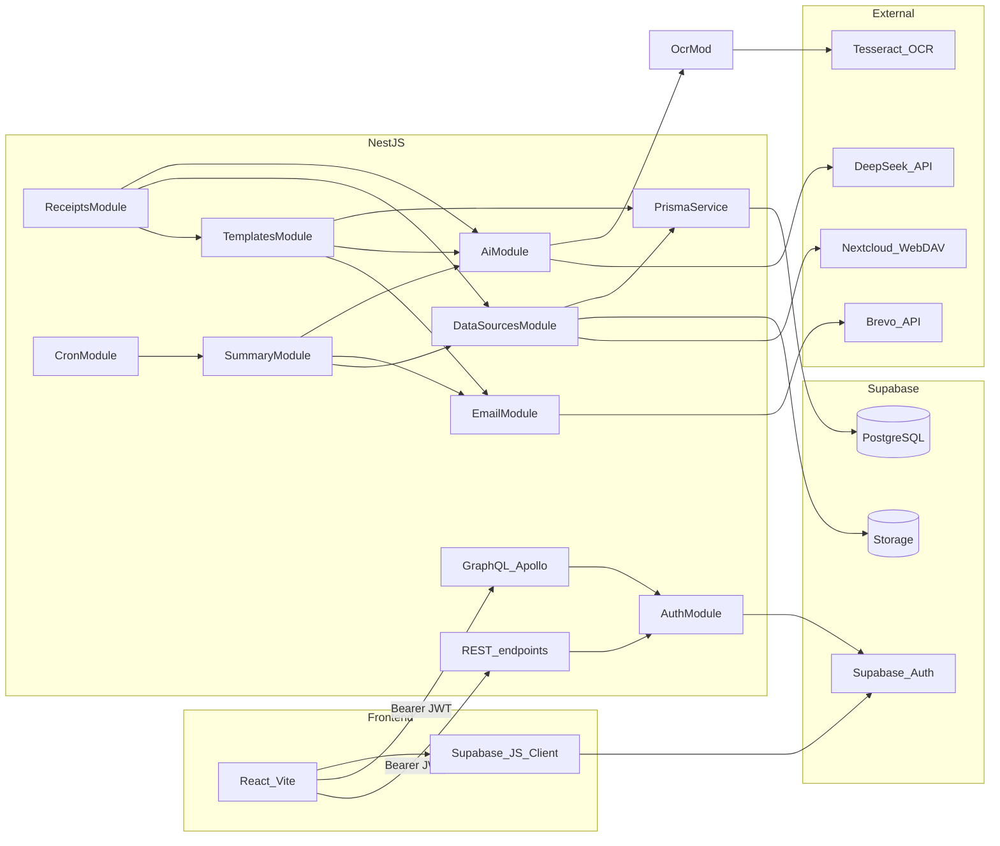

# Backend architecture

## System context

ExpenseAI backend is a NestJS modular monolith between the React frontend and Supabase (Auth + Postgres + Storage).

Implemented integrations:

- DeepSeek (`AiService`) for template generation, expense analysis, and receipt text extraction.
- Tesseract.js + Sharp (`ReceiptOcrService`) for receipt image preprocessing and OCR (`eng.traineddata` / `pol.traineddata` at repo root).
- Brevo HTTP API (`EmailService`) for sending rendered test emails.
- Supabase Storage + Nextcloud WebDAV as pluggable expense data sources.

Planned (not wired yet):

- ~~Monthly cron webhook pipeline (`/api/cron/process-summaries`).~~ Implemented — see [cron-summaries.md](./cron-summaries.md).

## Module graph

`AppModule` imports:

- `ConfigModule` (global)
- `GraphQLModule` (Code First, `src/schema.gql`)
- `PrismaModule`
- `AuthModule`
- `AiModule`
- `TemplatesModule`
- `DataSourcesModule`
- `EmailModule`
- `ReceiptsModule`
- `SummaryModule`
- `CronModule`

### Implemented modules

| Module              | Responsibility                                                               |
| ------------------- | ---------------------------------------------------------------------------- |
| `AuthModule`        | JWT strategy + guards for REST/GraphQL                                       |
| `UsersModule`       | User-profile provisioning and authenticated account deletion                 |
| `PrismaModule`      | Shared Prisma adapter client                                                 |
| `AiModule`          | DeepSeek template generation, expense analysis, and receipt extraction       |
| `ReceiptOcrModule`  | Tesseract worker lifecycle, image preprocessing (Sharp), OCR text extraction |
| `TemplatesModule`   | Template CRUD + active template + source settings + test-email mutation      |
| `DataSourcesModule` | Source providers, upload endpoint, source resolution                         |
| `EmailModule`       | Brevo email sending                                                          |
| `ReceiptsModule`    | Receipt scan + `approveReceiptExpenses` GraphQL mutations + OCR              |
| `SummaryModule`     | Per-user summary schedule GraphQL + batch summary pipeline                   |
| `CronModule`        | Secured REST webhook for hourly batch processing                             |

### REST endpoints

| Method | Path                          | Auth                 | Notes                                           |
| ------ | ----------------------------- | -------------------- | ----------------------------------------------- |
| `POST` | `/api/cron/process-summaries` | `Bearer CRON_SECRET` | Hourly batch trigger for monthly summary emails |

## Authentication flow

1. Frontend authenticates with Supabase (email/password or Google OAuth 2.0) and gets `access_token`.
2. Frontend calls NestJS with `Authorization: Bearer <token>`.
3. REST uses `JwtAuthGuard`; GraphQL uses `GqlAuthGuard`. (REST controllers were removed; guards remain available if REST is reintroduced.)
4. `JwtStrategy` validates token via:
   - Supabase JWKS (`SUPABASE_URL`) for ES256 projects
   - or legacy `SUPABASE_JWT_SECRET` for HS256
5. Handlers get user via `@CurrentUser()` / `@CurrentUserGql()`.
6. `UserProfileService.ensureUserProfile` upserts local `User` profile on first authenticated access.

## Data-source architecture

Expense data source is resolved per user from:

- `data_source_type` (`FILE_UPLOAD` / `NEXTCLOUD`)
- `data_source_config` (provider-specific JSON)

`DataSourceResolverService` dispatches to:

- `FileUploadProvider` (read file from Supabase Storage)
- `NextcloudProvider` (read file from Nextcloud WebDAV path)

`SupabaseStorageService` talks to Supabase Storage via direct REST (`axios` + service role key), not the Supabase JS client. It supports `readTextFileOrEmpty` for optional file reads used by receipt approval.

## API surface

All client-facing operations are exposed through GraphQL at `/graphql`.

| Kind     | Name                          | Auth   | Notes                                                                               |
| -------- | ----------------------------- | ------ | ----------------------------------------------------------------------------------- |
| Query    | `health`                      | Public | Health/hello smoke check                                                            |
| Query    | `myProfile`                   | JWT    | Auth smoke test                                                                     |
| Query    | `myTemplates`                 | JWT    | List current user templates                                                         |
| Query    | `myTemplateSettings`          | JWT    | Active template + source settings                                                   |
| Query    | `currentExpenseFile`          | JWT    | Current uploaded file metadata + content                                            |
| Mutation | `generateTemplate`            | JWT    | Generate template via DeepSeek                                                      |
| Mutation | `createTemplate`              | JWT    | Create template                                                                     |
| Mutation | `updateTemplate`              | JWT    | Update template                                                                     |
| Mutation | `deleteTemplate`              | JWT    | Delete template                                                                     |
| Mutation | `setActiveTemplate`           | JWT    | Set active template                                                                 |
| Mutation | `updateDataSource`            | JWT    | Switch/update source config                                                         |
| Mutation | `uploadExpenseFile`           | JWT    | Upload `.txt/.csv` (max 2MB, base64), set source to `FILE_UPLOAD`                   |
| Mutation | `overwriteCurrentExpenseFile` | JWT    | Overwrite currently configured uploaded file (base64)                               |
| Mutation | `sendTestEmail`               | JWT    | Render active template with sample values and send via Brevo                        |
| Query    | `mySummarySchedule`           | JWT    | Read automatic summary schedule settings                                            |
| Mutation | `updateSummarySchedule`       | JWT    | Update schedule and recalculate `next_summary_at`                                   |
| Mutation | `sendSummaryNow`              | JWT    | Analyze the current expense file and email a real summary without changing schedule |
| Mutation | `deleteMyAccount`             | JWT    | Delete Supabase Auth identity, profile data, and uploaded expense file              |
| Mutation | `scanReceipt`                 | JWT    | Upload receipt image (JPEG/PNG/WEBP, max 2MB, base64); returns `{ extractedText }`  |
| Mutation | `approveReceiptExpenses`      | JWT    | Append edited receipt expense text to the user's uploaded expense file              |

File upload mutations accept `ExpenseFileUploadInput` / `ScanReceiptInput` with `fileName`, `mimeType`, and `contentBase64` fields.

## Receipt scan + approval flow

`scanReceipt` (`ReceiptsResolver` → `ReceiptsService`):

1. Validates image type and size.
2. `AiService.extractExpensesFromImage` preprocesses the image (Sharp), runs OCR (`ReceiptOcrService` / Tesseract), then sends OCR text to DeepSeek.
3. Returns plain-text expense lines (or `NO_EXPENSES_FOUND`).

`approveReceiptExpenses` (`ReceiptsResolver` → `ReceiptsService`):

1. Resolves the user's `FILE_UPLOAD` source config via `TemplatesService`.
2. Reads current file content (empty string if missing).
3. Appends approved receipt text and overwrites the Storage object.
4. Updates `uploadedAt` in `data_source_config`.

## Expense analysis flow

`AiService.analyzeExpenses(rawExpenseContent, language, currency, period)`:

1. `parseExpenseFile()` (`src/ai/expense-file.parser.ts`) deterministically parses raw expense text into a salary total plus a canonical expense list (duplicate names are merged case/whitespace-insensitively; every amount is stored in cents).
2. DeepSeek receives only the canonical expense list (`id`, `name`, `amount`) and a computed totals hint. Its JSON response is limited to category names + `itemIds` assignments and a `savingsMessage` — it never computes or returns amounts, totals, or the current month.
3. `reconcileExpenseAnalysis()` (`src/ai/expense-analysis.reconciler.ts`) rebuilds `salaryAmount`, `totalExpenses`, `savingsAmount`, and per-category/item totals purely from the canonical cents. AI-provided `itemIds` are validated against the canonical list; unknown or duplicate IDs are dropped and any unassigned expenses fall into an "Other expenses" category. This guarantees totals stay internally consistent even if the AI miscategorizes something.
4. `formatMoneyAmount()` (`src/ai/expense-amount.formatter.ts`) formats cents into locale-aware strings (e.g. `1 234,56 zł` for PL, `1,234.56 PLN` for EN).
5. `currentMonth` is derived from the caller-supplied `period` (`YYYY-MM`) via `formatSummaryMonth()` instead of "now", so cron-generated summaries always label the month they actually cover.

All arithmetic stays deterministic in application code; the LLM is only responsible for categorization and the natural-language `savingsMessage`.

## Rendering + email flow

`TemplatesService.sendTestEmail`:

1. Ensures user exists and has active template.
2. Uses `template-renderer.ts` to inject sample values.
3. Calls `EmailService.sendEmail(...)` to Brevo `/smtp/email`.

## Error handling and resiliency

- Service layer throws typed Nest exceptions for domain errors.
- Provider misconfiguration returns `ServiceUnavailableException`.
- Upload/download storage failures bubble with context-rich messages.
- Cron fault-tolerance behavior is implemented in `SummaryService.processDueSummaries()` — per-user try/catch with `SummaryLog` persistence.

See [cron-summaries.md](./cron-summaries.md) for scheduler and webhook details.

## Security notes

- Secrets remain server-side (`DEEPSEEK_API_KEY`, `BREVO_API_KEY`, `SUPABASE_SERVICE_ROLE_KEY`, Nextcloud credentials).
- Frontend only uses Supabase user access token; service role key is never exposed.
- Prisma adapter strips SSL params from URL and applies explicit TLS option via `DATABASE_SSL_REJECT_UNAUTHORIZED`.

See also [database.md](./database.md) and [conventions.md](./conventions.md).
