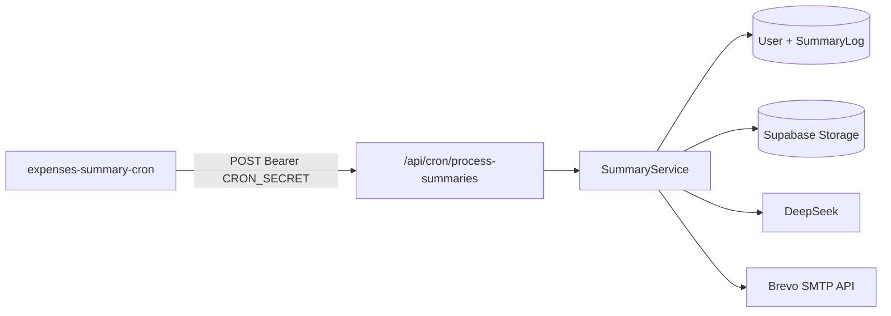

# Monthly summary cron

Automated expense summary emails are triggered by a single external scheduler and processed in batch by the NestJS backend.

## Architecture



- One scheduler job runs hourly (`docker/cron/crontab`).
- The backend selects users where `summary_enabled = true`, `next_summary_at <= now()`, active template exists, and data source config is valid.
- Each due user is processed independently; one failure does not stop the batch.

## REST endpoint

| Method | Path                          | Auth                                  | Response                                                            |
| ------ | ----------------------------- | ------------------------------------- | ------------------------------------------------------------------- |
| `POST` | `/api/cron/process-summaries` | `Authorization: Bearer <CRON_SECRET>` | `{ processed, succeeded, failed, skipped, failures[], outcomes[] }` |

Manual trigger example:

```bash
curl -X POST "http://localhost:5173/api/cron/process-summaries" \
  -H "Authorization: Bearer $CRON_SECRET"
```

## Processing pipeline

For each due user:

1. Skip if the user has no remaining AI credits (`AiUsageService.hasRemainingCredits`) — outcome `skipped` with reason `AI credit limit reached`.
2. Resolve expense file through `DataSourceResolverService` (`FILE_UPLOAD` or `NEXTCLOUD`).
3. Analyze content with `AiService.analyzeExpenses(..., trigger: SCHEDULED)`, passing the user's `summary_email_language` (`PL` / `EN`), `summary_currency`, and the resolved `period` (`YYYY-MM`). Amounts/totals are computed deterministically from the parsed file and only cross-checked against the AI's categorization — see [Expense analysis flow](./architecture.md#expense-analysis-flow). Token usage is audited as `EXPENSE_SUMMARY` / `SCHEDULED`.
4. Map the reconciled categories to an HTML expense table via `buildExpensesListHtml()`, then inject placeholders into the active template.
5. Render active HTML template with `applyTemplateValues()`.
6. Send email to `User.email` through `EmailService`.
7. Upsert `SummaryLog` with period key `YYYY-MM` (previous calendar month in user timezone).
8. Advance `next_summary_at` to the next scheduled occurrence.

On failure:

- `SummaryLog` is stored with `FAILURE` and `error_message`.
- `next_summary_at` is left unchanged so the user remains eligible on the next hourly run.

## User schedule fields

Stored on `User`:

| Field                    | Default         | Description                                   |
| ------------------------ | --------------- | --------------------------------------------- |
| `summary_schedule_day`   | `1`             | Day of month (`1-28`)                         |
| `summary_schedule_hour`  | `8`             | Hour (`0-23`)                                 |
| `summary_timezone`       | `Europe/Warsaw` | IANA timezone                                 |
| `summary_email_language` | `PL`            | Email output language (`PL` / `EN`)           |
| `summary_currency`       | `PLN`           | Output currency formatting (no FX conversion) |
| `summary_enabled`        | `false`         | Whether batch processing includes the user    |
| `next_summary_at`        | `null`          | Next planned send timestamp (UTC)             |

## Manual current summary

The authenticated `sendSummaryNow` GraphQL mutation runs the same data-source,
AI analysis, template rendering, and email delivery steps immediately (trigger
`MANUAL`). It sends to the account email but does not create a `SummaryLog` or
change `next_summary_at`. When the user's monthly AI credit limit is reached,
the mutation fails with a clear `BadRequestException`.

Users manage these settings through GraphQL:

- Query: `mySummarySchedule`
- Mutation: `updateSummarySchedule`

## Docker production setup

[`docker-compose-prod.yml`](../docker-compose-prod.yml) defines:

- `expenses-tracking-api` — NestJS API with `CRON_SECRET`
- `expenses-summary-cron` — Alpine + `supercronic` sidecar calling the API over the internal Docker network

Required env vars:

```env
CRON_SECRET=...
```

The sidecar uses:

```env
CRON_TARGET_URL=http://expenses-api:5173/api/cron/process-summaries
```

Cron files:

- [`docker/cron/crontab`](../docker/cron/crontab)
- [`docker/cron/trigger-summary.sh`](../docker/cron/trigger-summary.sh)
- [`docker/cron/Dockerfile`](../docker/cron/Dockerfile)

## Idempotency

`SummaryLog` has a unique constraint on `(user_id, period)`.

If a successful log already exists for the current period, the service advances `next_summary_at` without sending again.

## Related code

| Area                  | Path                                    |
| --------------------- | --------------------------------------- |
| Batch service         | `src/summary/summary.service.ts`        |
| Schedule math         | `src/summary/summary-schedule.util.ts`  |
| REST controller       | `src/cron/cron.controller.ts`           |
| Cron auth guard       | `src/cron/cron-auth.guard.ts`           |
| GraphQL schedule API  | `src/summary/summary.resolver.ts`       |
| Expense file parsing  | `src/ai/expense-file.parser.ts`         |
| Amount reconciliation | `src/ai/expense-analysis.reconciler.ts` |
| Money formatting      | `src/ai/expense-amount.formatter.ts`    |

See also [database.md](./database.md) and [architecture.md](./architecture.md).
