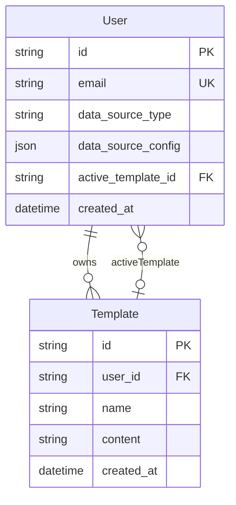

# Database documentation

PostgreSQL is hosted on Supabase and accessed through Prisma 7 (`@prisma/client` + `@prisma/adapter-pg`).

- Schema: [prisma/schema.prisma](../prisma/schema.prisma)
- Migrations: `prisma/migrations/`
- Prisma config: [prisma.config.ts](../prisma.config.ts)

## Models (current)

### `User`

Application profile linked to Supabase Auth (`User.id` should match JWT `sub`).

| Field | Type | Description |
|---|---|---|
| `id` | `String` PK | Supabase Auth UID |
| `email` | `String` unique | User email |
| `data_source_type` | `DataSourceType` | Selected source (`FILE_UPLOAD` / `NEXTCLOUD`) |
| `data_source_config` | `Json?` | Provider-specific configuration payload |
| `active_template_id` | `String?` FK | Currently active template |
| `created_at` | `DateTime` | Profile creation timestamp |

Relations:

- `templates` — owned templates
- `activeTemplate` — selected template (`ActiveTemplate` relation)

### `Template`

HTML email template with dynamic placeholders.

| Field | Type | Description |
|---|---|---|
| `id` | `String` PK | Template id |
| `user_id` | `String` FK | Owner id |
| `name` | `String` | Display name |
| `content` | `String` | Raw HTML |
| `created_at` | `DateTime` | Creation timestamp |

Relations:

- `user` — owner (`onDelete: Cascade`)
- `activeForUsers` — users who selected this template as active

### `DataSourceType` enum

| Value | Meaning |
|---|---|
| `FILE_UPLOAD` | Expense text/csv file stored in Supabase Storage |
| `NEXTCLOUD` | Expense file fetched from Nextcloud WebDAV |

## `data_source_config` shapes

### `FILE_UPLOAD`

```json
{
  "bucket": "expenses",
  "filePath": "user-uuid/2026-06.txt",
  "uploadedAt": "2026-06-05T12:00:00.000Z",
  "originalFileName": "wydatki-czerwiec.txt"
}
```

### `NEXTCLOUD`

```json
{
  "filePath": "/shared/wydatki/2026-06.txt"
}
```

## Relationship diagram



## Migrations

| Migration | Description |
|---|---|
| `20260603205715_init` | Initial `User` + `Template` schema |
| `20260604120000_drop_active_template_fk` | Placeholder migration to keep history consistent |
| `20260605133200_add_data_sources` | Adds `DataSourceType`, `data_source_type`, `data_source_config`; migrates and drops `nextcloud_file_path` |

## Business rules

- Every authenticated user is upserted on-demand in `TemplatesService.ensureUserExists`.
- At most one active template per user (`active_template_id`).
- `updateDataSource` enforces:
  - Nextcloud path required for `NEXTCLOUD`
  - existing upload config preserved when switching to `FILE_UPLOAD`
- Upload endpoint stores file in Storage and persists source config in `User.data_source_config`.

## Commands

```bash
# apply local schema changes and create a migration
pnpm prisma migrate dev --name <change_name>

# apply existing migrations (deploy/runtime envs)
pnpm prisma migrate deploy

# regenerate client
pnpm prisma generate
```

## Supabase notes

- Runtime DB access uses `DATABASE_URL`.
- Migrations prefer `DIRECT_URL` when available.
- Storage operations are done server-side with `SUPABASE_SERVICE_ROLE_KEY`.

See [architecture.md](./architecture.md) for module and API interactions.
