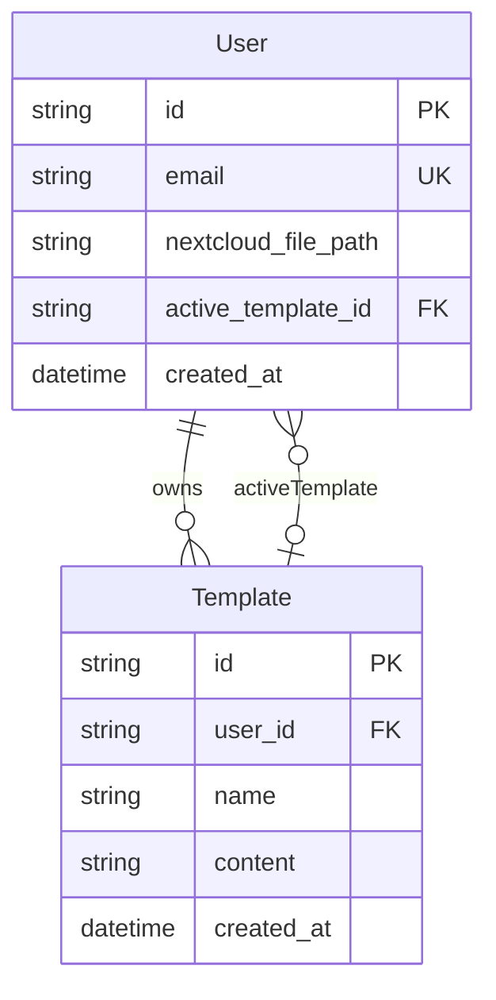

# Database documentation

PostgreSQL hosted on **Supabase**, accessed via **Prisma 7**. Schema lives in [prisma/schema.prisma](../prisma/schema.prisma); connection URLs come from `.env` (`DATABASE_URL`, `DIRECT_URL`) via [prisma.config.ts](../prisma.config.ts).

## Models (current)

### User

Application profile linked to Supabase Auth. `id` should equal the Supabase Auth user UUID (`sub` from JWT).

| Field | Type | Description |
|-------|------|-------------|
| `id` | `String` (UUID, PK) | Same as Supabase Auth UID |
| `email` | `String` (unique) | User email |
| `nextcloud_file_path` | `String?` | Path to expense file on shared Nextcloud |
| `active_template_id` | `String?` (FK) | Currently selected template for monthly emails |
| `created_at` | `DateTime` | Profile creation time |

**Relations:**

- `templates` — all templates owned by the user
- `activeTemplate` — optional FK to the template used for sends (`ActiveTemplate` relation name)

### Template

HTML email template with placeholders for AI-filled expense data.

| Field | Type | Description |
|-------|------|-------------|
| `id` | `String` (UUID, PK) | Template id |
| `user_id` | `String` (FK) | Owner |
| `name` | `String` | Display name in the UI |
| `content` | `String` | Raw HTML with variable placeholders |
| `created_at` | `DateTime` | Creation time |

**Relations:**

- `user` — owner (`onDelete: Cascade` when user is deleted)
- `activeForUsers` — users who selected this template as active

## Relationship diagram



**Business rules (intended):**

- A user may have many templates; at most one is active via `active_template_id`.
- Deleting a user cascades to their templates.
- Setting `active_template_id` should reference a template owned by the same user (enforce in service layer until DB constraint is added).

## Planned: SummaryLog

From [PLAN.md](../PLAN.md) — optional table for monthly processing history (success/failure per user, timestamps). Not in schema yet.

## Migrations

Initial migration: `20260603205715_init` — creates `User` and `Template` with indexes and foreign keys.

### Workflow

```bash
# After editing prisma/schema.prisma
pnpm prisma migrate dev --name describe_change

# Regenerate client
pnpm prisma generate
```

- **Runtime queries:** use `DATABASE_URL` (pooled).
- **Migrations:** `prisma.config.ts` prefers `DIRECT_URL` for direct Postgres access.

Lock file: `prisma/migrations/migration_lock.toml` (provider: `postgresql`).

## Supabase-specific notes

### Auth UID sync

When a user first signs up via Supabase Auth, create a `User` row with `id = jwt.sub` and `email` from the token. Do not generate a separate UUID unrelated to Auth.

### Row Level Security (RLS)

Migrations in this repo do not enable RLS. The NestJS API is the primary access path using the service role / connection string. If exposing Supabase client direct table access later, add RLS policies per table.

### JWT vs database user

Authentication proves identity via JWT; authorization and profile data live in `User` / `Template`. Handlers should resolve the DB user by `CurrentUser().id`.

## Prisma in the application (TODO)

`PrismaService` is not wired in NestJS yet. Target pattern:

```typescript
// src/prisma/prisma.service.ts — illustrative
@Injectable()
export class PrismaService extends PrismaClient implements OnModuleInit {
  async onModuleInit() {
    await this.$connect();
  }
}
```

Register as a global or imported module and inject only into services.

## Useful commands

| Command | Purpose |
|---------|---------|
| `pnpm prisma studio` | Browse data in GUI |
| `pnpm prisma migrate status` | Check migration state |
| `pnpm prisma db pull` | Introspect DB (use with care) |

See [architecture.md](./architecture.md) for how services use the database.
