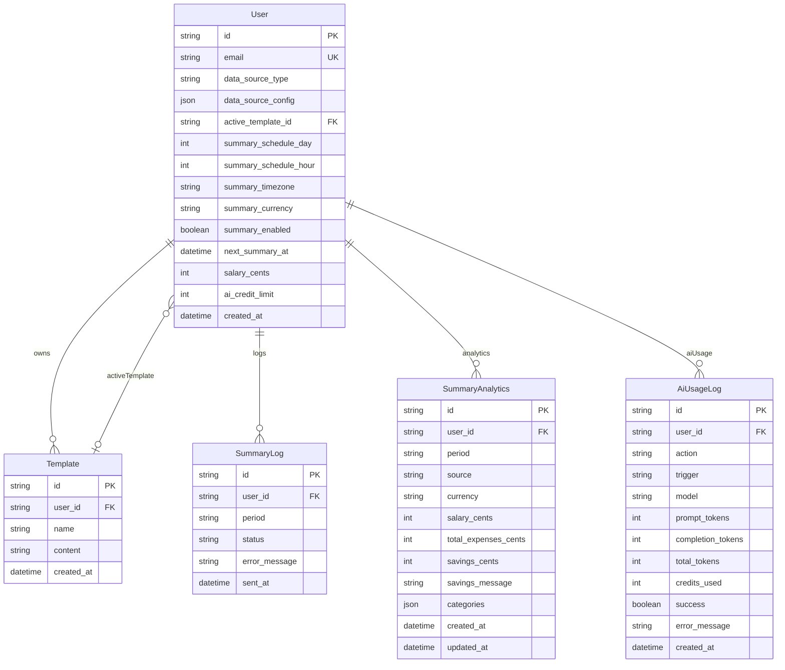

# Database documentation

PostgreSQL is hosted on Supabase and accessed through Prisma 7 (`@prisma/client` + `@prisma/adapter-pg`).

- Schema: [prisma/schema.prisma](../prisma/schema.prisma)
- Migrations: `prisma/migrations/`
- Prisma config: [prisma.config.ts](../prisma.config.ts)

## Models (current)

### `User`

Application profile linked to Supabase Auth (`User.id` should match JWT `sub`).

| Field                    | Type                   | Description                                              |
| ------------------------ | ---------------------- | -------------------------------------------------------- |
| `id`                     | `String` PK            | Supabase Auth UID                                        |
| `email`                  | `String` unique        | User email                                               |
| `data_source_type`       | `DataSourceType`       | Selected source (`FILE_UPLOAD` / `NEXTCLOUD`)            |
| `data_source_config`     | `Json?`                | Provider-specific configuration payload                  |
| `active_template_id`     | `String?` FK           | Currently active template                                |
| `summary_schedule_day`   | `Int`                  | Day of month for automatic summary (`1-28`, default `1`) |
| `summary_schedule_hour`  | `Int`                  | Hour of day for automatic summary (`0-23`, default `8`)  |
| `summary_timezone`       | `String`               | IANA timezone (default `Europe/Warsaw`)                  |
| `summary_email_language` | `SummaryEmailLanguage` | Email output language (`PL` / `EN`, default `PL`)        |
| `summary_currency`       | `String`               | Report currency (default `PLN`)                          |
| `summary_enabled`        | `Boolean`              | Whether user receives automatic summaries                |
| `next_summary_at`        | `DateTime?`            | Next planned send timestamp (UTC)                        |
| `salary_cents`           | `Int?`                 | Current salary/income in minor units (required for send) |
| `ai_credit_limit`        | `Int`                  | Monthly AI credit budget (default `50`)                  |
| `created_at`             | `DateTime`             | Profile creation timestamp                               |

Relations:

- `templates` — owned templates
- `activeTemplate` — selected template (`ActiveTemplate` relation)
- `summaryLogs` — history of processed summary periods
- `summaryAnalytics` — persisted monthly expense analytics snapshots
- `aiUsageLogs` — AI spend audit entries

### `SummaryLog`

Batch processing history and idempotency guard.

| Field           | Type               | Description                        |
| --------------- | ------------------ | ---------------------------------- |
| `id`            | `String` PK        | Log id                             |
| `user_id`       | `String` FK        | Owner id                           |
| `period`        | `String`           | Summary period key, e.g. `2026-05` |
| `status`        | `SummaryLogStatus` | `SUCCESS` or `FAILURE`             |
| `error_message` | `String?`          | Failure reason when applicable     |
| `sent_at`       | `DateTime`         | Processing timestamp               |

Unique constraint: `(user_id, period)`.

### `SummaryAnalytics`

Queryable monthly expense analytics for the dashboard (separate from email idempotency in `SummaryLog`).

| Field                  | Type                     | Description                                          |
| ---------------------- | ------------------------ | ---------------------------------------------------- |
| `id`                   | `String` PK              | Analytics row id                                     |
| `user_id`              | `String` FK              | Owner id                                             |
| `period`               | `String`                 | Summary period key, e.g. `2026-05`                   |
| `source`               | `SummaryAnalyticsSource` | `SCHEDULED` (cron email) or `MANUAL` (user backfill) |
| `currency`             | `String`                 | Snapshot of report currency at write time            |
| `salary_cents`         | `Int`                    | Salary in minor units                                |
| `total_expenses_cents` | `Int`                    | Total expenses in minor units                        |
| `savings_cents`        | `Int`                    | `salary_cents - total_expenses_cents`                |
| `savings_message`      | `String?`                | Optional narrative                                   |
| `categories`           | `Json`                   | Array of canonical category buckets with line items  |
| `created_at`           | `DateTime`               | First insert timestamp                               |
| `updated_at`           | `DateTime`               | Last update timestamp (manual edits bump this)       |

Unique constraint: `(user_id, period)`.

`categories` JSON shape (canonical English keys):

```json
[
  {
    "name": "Groceries",
    "totalCents": 9400,
    "items": [{ "name": "Kebab", "amountCents": 9400 }]
  }
]
```

Closed category keys: `Bills`, `Groceries`, `DiningOut`, `Transport`, `Education`, `Entertainment`, `Investments`, `Car`, `Clothing`, `Snacks`, `Health`, `Travel`, `Gifts`, `Other`.

### `Template`

HTML email template with dynamic placeholders.

| Field        | Type        | Description        |
| ------------ | ----------- | ------------------ |
| `id`         | `String` PK | Template id        |
| `user_id`    | `String` FK | Owner id           |
| `name`       | `String`    | Display name       |
| `content`    | `String`    | Raw HTML           |
| `created_at` | `DateTime`  | Creation timestamp |

Relations:

- `user` — owner (`onDelete: Cascade`)
- `activeForUsers` — users who selected this template as active

### `AiUsageLog`

Per-call AI spend audit trail (DeepSeek token usage).

| Field               | Type             | Description                                                |
| ------------------- | ---------------- | ---------------------------------------------------------- |
| `id`                | `String` PK      | Log id                                                     |
| `user_id`           | `String` FK      | Owner id                                                   |
| `action`            | `AiActionType`   | `TEMPLATE_GENERATION` / `EXPENSE_SUMMARY` / `RECEIPT_SCAN` |
| `trigger`           | `AiUsageTrigger` | `MANUAL` (default) or `SCHEDULED`                          |
| `model`             | `String`         | Model id used for the call                                 |
| `prompt_tokens`     | `Int`            | Prompt tokens from DeepSeek `usage`                        |
| `completion_tokens` | `Int`            | Completion tokens from DeepSeek `usage`                    |
| `total_tokens`      | `Int`            | Total tokens from DeepSeek `usage`                         |
| `credits_used`      | `Int`            | `ceil(total_tokens / AI_TOKENS_PER_CREDIT)`                |
| `success`           | `Boolean`        | Whether the AI call produced usable output                 |
| `error_message`     | `String?`        | Failure detail when `success = false`                      |
| `created_at`        | `DateTime`       | Call timestamp                                             |

Index: `(user_id, created_at)`.

### `SummaryAnalyticsSource` enum

| Value       | Meaning                                      |
| ----------- | -------------------------------------------- |
| `SCHEDULED` | Inserted after successful cron summary email |
| `MANUAL`    | User-created historical backfill             |

### `DataSourceType` enum

| Value         | Meaning                                          |
| ------------- | ------------------------------------------------ |
| `FILE_UPLOAD` | Expense text/csv file stored in Supabase Storage |
| `NEXTCLOUD`   | Expense file fetched from Nextcloud WebDAV       |

### `SummaryLogStatus` enum

| Value     | Meaning            |
| --------- | ------------------ |
| `SUCCESS` | Summary email sent |
| `FAILURE` | Processing failed  |

### `SummaryEmailLanguage` enum

| Value | Meaning               |
| ----- | --------------------- |
| `PL`  | Polish summary email  |
| `EN`  | English summary email |

### `AiActionType` enum

| Value                 | Meaning                            |
| --------------------- | ---------------------------------- |
| `TEMPLATE_GENERATION` | AI email template generation       |
| `EXPENSE_SUMMARY`     | Expense analysis for summary email |
| `RECEIPT_SCAN`        | Receipt OCR → expense extraction   |

### `AiUsageTrigger` enum

| Value       | Meaning                        |
| ----------- | ------------------------------ |
| `MANUAL`    | User-initiated GraphQL action  |
| `SCHEDULED` | Cron / automatic summary batch |

## `data_source_config` shapes

### `FILE_UPLOAD`

```json
{
  "bucket": "expenses",
  "filePath": "user-uuid/2026-06.txt",
  "uploadedAt": "2026-06-05T12:00:00.000Z",
  "originalFileName": "wydatki-czerwiec.txt"
}
```

### `NEXTCLOUD`

```json
{
  "filePath": "/shared/wydatki/2026-06.txt"
}
```

## Relationship diagram



## Migrations

| Migration                                   | Description                                                                                               |
| ------------------------------------------- | --------------------------------------------------------------------------------------------------------- |
| `20260603205715_init`                       | Initial `User` + `Template` schema                                                                        |
| `20260604120000_drop_active_template_fk`    | Placeholder migration to keep history consistent                                                          |
| `20260605133200_add_data_sources`           | Adds `DataSourceType`, `data_source_type`, `data_source_config`; migrates and drops `nextcloud_file_path` |
| `20260614120000_add_summary_schedule`       | Adds summary schedule fields on `User`, `SummaryLog`, and `SummaryLogStatus` enum                         |
| `20260614200000_add_summary_email_language` | Adds `summary_email_language` (`PL` / `EN`) on `User`                                                     |
| `20260715193600_add_summary_currency`       | Adds the preferred summary report currency (default `PLN`)                                                |
| `20260801120000_add_ai_usage_tracking`      | Adds `ai_credit_limit` on `User`, `AiUsageLog`, `AiActionType`, and `AiUsageTrigger`                      |
| `20260805194853_add_summary_analytics`      | Adds `SummaryAnalytics` table and `SummaryAnalyticsSource` enum                                           |

## Business rules

- Every authenticated user is upserted on-demand in `UserProfileService.ensureUserProfile` (new profiles get `ai_credit_limit` from `AI_MONTHLY_CREDIT_LIMIT`).
- At most one active template per user (`active_template_id`).
- `updateDataSource` enforces:
  - Nextcloud path required for `NEXTCLOUD`
  - existing upload config preserved when switching to `FILE_UPLOAD`
- Upload endpoint stores file in Storage and persists source config in `User.data_source_config`.
- `approveReceiptExpenses` appends approved receipt text to the user's existing `FILE_UPLOAD` expense file (creates content if the file is missing) and updates `uploadedAt` in `data_source_config`. Requires `FILE_UPLOAD` as the active data source.
- Automatic summaries require `summary_enabled = true`, active template, valid data source config, and a computed `next_summary_at`.
- After a successful scheduled summary email, the backend inserts a `SummaryAnalytics` row (`source = SCHEDULED`) only when one does not already exist for that `(user_id, period)`. Existing analytics are never overwritten by cron.
- `sendSummaryNow` sends email only — it does not write `SummaryAnalytics`.
- Manual analytics create/update/view require an ended month (`period < current YYYY-MM` in the user's timezone). Once the new month has started, the previous month can be created manually. Update may rewrite either `SCHEDULED` or `MANUAL` rows; it does not change `source` or currency.
- Accepted analytics periods start at `2026-01` (earlier months are rejected).
- Category keys in analytics JSON must belong to the closed vocabulary listed above.
- Report currency is restricted by the API to `PLN`, `EUR`, `USD`, `GBP`, `CHF`, `CZK`, or `UAH`; it controls AI output formatting and does not perform exchange-rate conversion.
- AI spend is capped monthly per user (`User.ai_credit_limit`). Credits = `ceil(total_tokens / AI_TOKENS_PER_CREDIT)`. Manual AI actions fail when the budget is exhausted; cron summaries skip those users.
- `deleteMyAccount` removes the Supabase Auth identity, local profile (including cascaded templates, summary logs, summary analytics, and AI usage logs), and best-effort removes the uploaded expense file.

See [cron-summaries.md](./cron-summaries.md) for batch processing details.

## Commands

```bash
# apply local schema changes and create a migration
pnpm prisma migrate dev --name <change_name>

# apply existing migrations (deploy/runtime envs)
pnpm prisma migrate deploy

# regenerate client
pnpm prisma generate
```

## Supabase notes

- Runtime DB access uses `DATABASE_URL`.
- Migrations prefer `DIRECT_URL` when available.
- Storage operations are done server-side with `SUPABASE_SERVICE_ROLE_KEY`.

See [architecture.md](./architecture.md) for module and API interactions.
